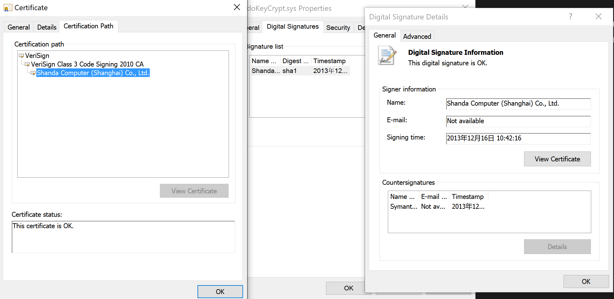
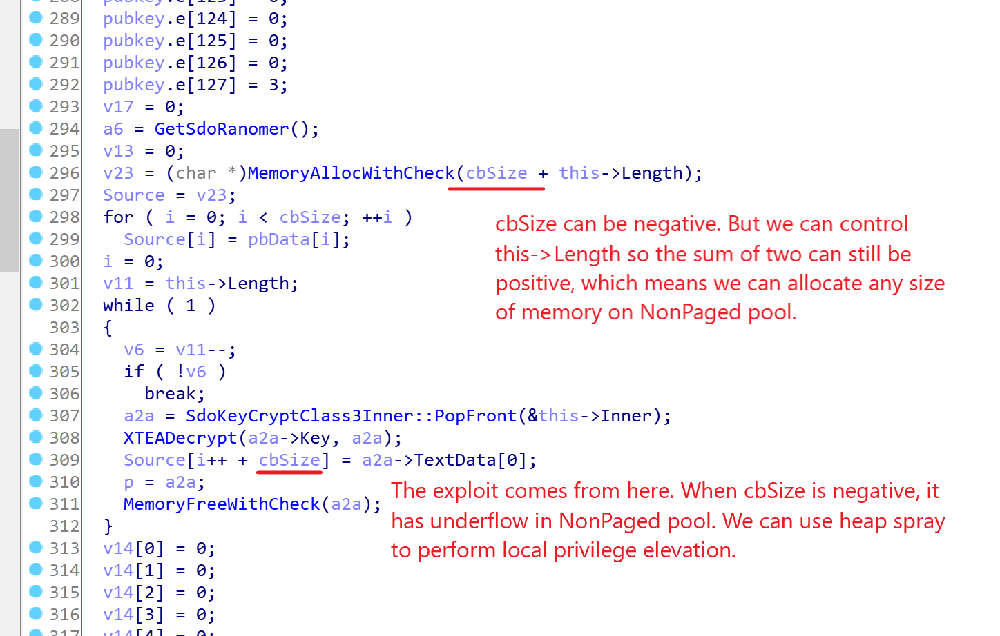
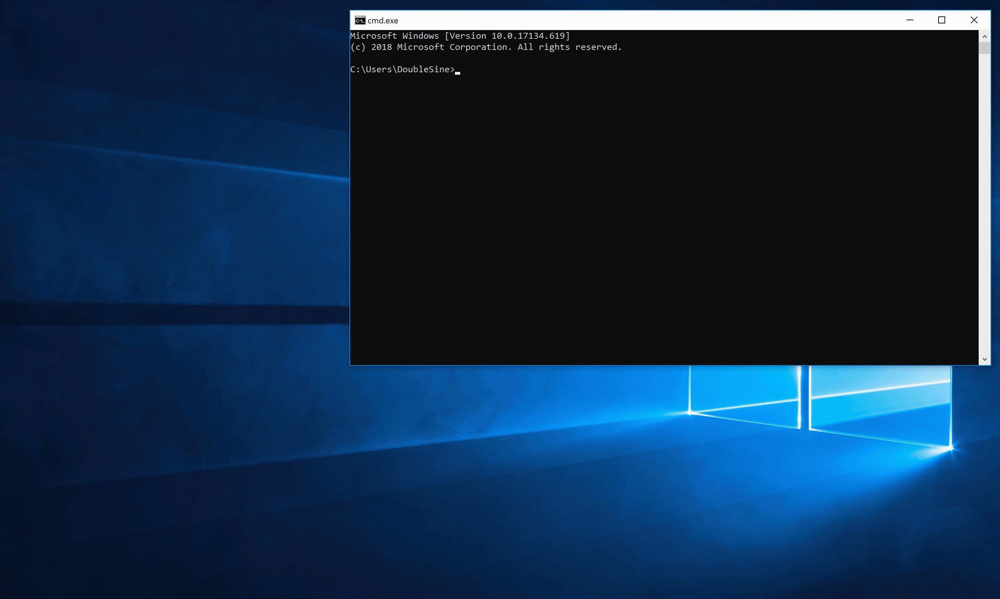

# SdoKeyCrypt.sys - Local Privilege Elevation Vulnerability

## 1. What is SdoKeyCrypt.sys?

__SdoKeyCrypt.sys__ is a keyboard protection driver for a MMORPG, aka Massively-Multiplayer-Online-Role-Playing-Game, called [___MapleStory Online___](https://en.wikipedia.org/wiki/MapleStory) which is published by [_Shanda Group_](https://en.wikipedia.org/wiki/Shanda) in China. 

This driver will be downloaded and installed in `C:\Windows\System32\` folder when the game runs first time. Because the game is very big, approximately 13.11 GB, here I made a backup [SdoKeyCrypt.sys](SdoKeyCrypt.sys) for anyone who wants to reproduce this exploit.

__`SdoKeyCrypt.sys` is surely OFFICIAL and is NOT modified by anyone.__ 

You can see there's a valid digest signature signed by _Shanda Computer (Shanghai) Co., Ltd._ which confirms `SdoKeyCrypt.sys` is indeed made by _Shanda_.



## 2. What is the vulnerability caused by?

In `IRP_MJ_DEVICE_CONTROL` handle routine, when IOCTL code is `(DWORD)(-0x7FFF3FFC + 0x18) = 0x8000c01c`, the driver does not properly handle data passed from user space, which causes a size value can be negative so that a heap underflow will occur. 

With the help of heap spraying, aka pool-Feng-Shui attack, one can disable SMEP and run any shellcode in kernel mode to make local privilege elevation.




## 3. How to use PoC code?

With x64 Microsoft Visual C++ compiler (which supports c++11)

```console
$ cl poc.cpp /Fe:poc.exe /link /dynamicbase:no /fixed ntdll.lib
```

Tested on Visual Studio 2017 Community, the following is an example of output:

```console
C:\Github\SdoKeyCrypt-sys-local-privilege-elevation>cl poc.cpp /Fe:poc.exe /link /dynamicbase:no /fixed ntdll.lib
Microsoft (R) C/C++ Optimizing Compiler Version 19.16.27027.1 for x64
Copyright (C) Microsoft Corporation.  All rights reserved.

poc.cpp
Microsoft (R) Incremental Linker Version 14.16.27027.1
Copyright (C) Microsoft Corporation.  All rights reserved.

/out:poc.exe
/dynamicbase:no
/fixed
ntdll.lib
poc.obj
```

## 4. Screenshot

The PoC code has been tested and works fine on __Win10 1709__ and __Win10 1803__.

However it does not work on __Win10 1809__ which uses heap-backed pool that mitigates heap-spray attack. But it can cause BSOD, so there's local Denial-of-Service vulnerability at least.

The following is a test video on __Win10 1803 17134.619__.



